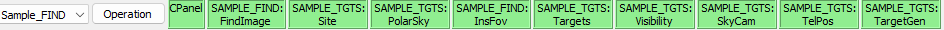
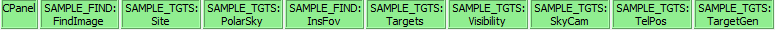

+++++++++++++++++++++
Channel Selection Row
+++++++++++++++++++++

Just above the channel settings buttons, there is a row of buttons 
which are used to determine and control which channel and plugins are 
in focus. Additionally there is an Operation menu, the contents of which 
are described in more detail below.

The left-most option is a drop-down menu which displays and 
selects the focus channel. The channel which is in focus is the 
channel which will be acted upon by any of the tool bar plugin actions 
and operation actions. The focus can be changed by selecting an 
option from the drop down menu (Targets channel or Find channel), 
clicking on one of the channel windows, or selecting one of the 
channel dependent plugins. 

=======================
CPanel Plugin Selection
=======================

Right of the Operation menu is a set of green and grey icons which 
control and show the focus status of the existing channels.

The icons show which plugins are active and which plugins are in focus.
Icons with green backgrounds indicate which plugins are in focus.
Activating plugins or closing plugins will add or remove their icons 
from this row, respectively. Selecting one of the plugin icons by 
left-clicking with the mouse will bring that plugin in focus, bringing 
the plugin window to the foreground and setting the icon background green. 
Only one plugin window per channel can be in focus at any time.

Right-clicking on one of the plugin icons will open a menu with the 
options "Focus", "Unfocus", "Stop", "Reload". Selecting "Focus" will change 
the focus to the selected plugin if it is not in focus already. 
"Unfocus" will unfocus the selected plugin if it was in focus. 
Selecting "Stop" will close the selected plugin, and selecting "Reload" 
will close the selected window and open it again. 

==============
Operation Menu
==============

.. toctree::
    :maxdepth: 1

    analysis
    custom
    debug
    planning
    rgb
    system
    utils
